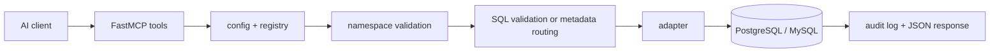

# 项目概览

本文帮助你快速理解 `sql-query-mcp` 是什么、解决什么问题，以及代码结构如
何组织。看完后，你应该能判断这个项目是否适合你的接入场景。

## 项目定位

`sql-query-mcp` 是一个面向 AI 数据库工作的通用 MCP 服务。它把数据库发现、
受控查询和执行计划等能力封装成 MCP tools，让 AI 客户端可以在明确、可审
计的边界内访问当前已接入的数据库。

这个项目的重点不是做一个无限制的数据库代理，而是在服务端收拢连接处理、
命名空间规则、SQL 校验和审计能力，为 AI 使用场景建立稳定、清晰的产品边
界。

## 解决的问题

很多 AI 查库方案会同时遇到下面几个问题：连接串暴露、写操作风险、跨引擎
概念混乱，以及调用链路难审计。`sql-query-mcp` 针对这些问题做了明确约束。

- 连接配置和真实 DSN 分离，DSN 只通过环境变量注入
- `engine` 必须显式声明，不从 `connection_id` 推断
- PostgreSQL 使用 `schema`，MySQL 使用 `database`
- 工具执行前先过只读 SQL 校验
- 每次调用都记录审计日志

## 核心概念

理解下面几个概念后，项目的大多数行为都会变得直观。

### 连接配置

每个连接都由 `connection_id` 唯一标识，并声明自己的数据库引擎、环境、租
户、角色和 DSN 环境变量名。

服务默认读取 `config/connections.json`，也支持通过
`SQL_QUERY_MCP_CONFIG` 指向自定义路径。

实现上，这部分由 `sql_query_mcp/config.py` 负责加载和校验。

### 命名空间解析

项目不会把 PostgreSQL 和 MySQL 粗暴映射成同一个抽象命名空间，而是保留
各自的原生概念。

- PostgreSQL: 使用 `schema`
- MySQL: 使用 `database`

服务会在进入数据库前完成参数合法性校验和默认值回退。

实现上，这部分逻辑位于 `sql_query_mcp/namespace.py`。

### 只读 SQL 校验

`run_select` 和 `explain_query` 在执行前都会先经过只读 SQL 校验。这里使用
`sqlglot` 做 AST 级校验，而不是只做关键字匹配。

这意味着：

- `SELECT` 和 `WITH ... SELECT` 可以通过
- 多语句、注释、DDL、DML、事务语句会被拒绝
- 字符串字面量中的敏感单词不会误触发拦截

实现上，相关校验逻辑位于 `sql_query_mcp/validator.py`。

### 审计日志

每次工具调用都会记录结果，包括成功和失败两类事件。审计信息至少包含工具
名、连接 ID、耗时、结果状态，以及 SQL 摘要或错误信息。

默认日志路径来自配置中的 `audit_log_path`。

实现上，日志写入由 `sql_query_mcp/audit.py` 负责。

## 工具分层

服务端逻辑可以分成四层，便于扩展和定位问题。

1. `sql_query_mcp/app.py` 暴露 MCP tools。
2. `sql_query_mcp/introspection.py` 和 `sql_query_mcp/executor.py` 实现工
   具行为。
3. `sql_query_mcp/registry.py` 管理连接配置、适配器和数据库连接。
4. `sql_query_mcp/adapters/` 处理 PostgreSQL / MySQL 方言差异。

## 请求流转

下面这条链路概括了一个典型请求如何从 AI 客户端进入数据库，再回到 MCP 响
应。

## 支持的能力

当前版本聚焦在元数据查询、只读查询和执行计划，不包含写操作或迁移能力。

- `list_connections`: 列出可用连接
- `list_schemas`: 列出 PostgreSQL schema
- `list_databases`: 列出 MySQL database
- `list_tables`: 列出表和视图
- `describe_table`: 查看列和索引
- `run_select`: 执行受限只读查询
- `explain_query`: 获取执行计划
- `get_table_sample`: 抽样读取表数据

详细参数和返回结构见 `docs/api-reference.md`。

## 适用场景

如果你的目标是把数据库上下文以受控方式提供给 AI，这个项目比较合适。下面
几类场景最匹配。

- 希望给 AI 助手开放结构发现、样本读取和只读分析能力，但保持明确边界
- 希望把连接处理、SQL 校验和审计记录集中在服务端，而不是交给客户端直连
- 让模型先看表结构、索引和样本，再生成或改写分析 SQL
- 需要在当前已接入的数据库之间复用同一套 MCP 接入方式，同时保留原生命名
  空间差异

## 不做什么

本文也明确列出当前版本刻意不做的事，避免误用。

- 不提供写操作接口
- 不替代数据库自身权限管理
- 不自动推断数据库引擎
- 不把 `schema` 和 `database` 混成统一字段
- 不支持复杂代理、连接编排或事务控制

## Next steps

如果你准备开始使用或继续改造项目，建议按下面的顺序阅读。

1. 先看 `README.md` 完成最小安装。
2. 再看 `docs/codex-setup.md` 或 `docs/opencode-setup.md` 完成客户端接入。
3. 最后看 `docs/api-reference.md` 了解每个 tool 的参数和返回结果。
